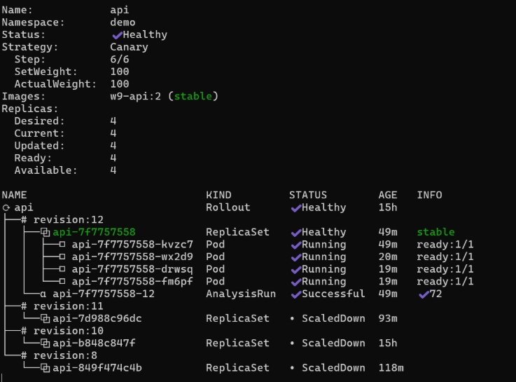

# Lab 4: Evidence - GitOps với Prometheus, Argo Rollouts và Canary Deployment

## Tổng quan Lab 4

Lab này thực hiện triển khai GitOps với:
- Prometheus + Alertmanager để monitoring và alerting
- Argo Rollouts cho progressive delivery (canary deployment)
- Flask API với metrics endpoint
- Email notification khi có lỗi vượt ngưỡng SLO

---

## 1. GitOps Infrastructure - Prometheus + Argo Rollouts

### 1.1. ArgoCD Applications

**Evidence: ArgoCD Root Application (App of Apps)**


**Screenshot Evidence:**


*Hình 1.1: ArgoCD applications đều ở trạng thái Synced*


*Hình 1.2: Tất cả pods trong namespace monitoring đang chạy (Prometheus, Grafana, Alertmanager)*


*Hình 1.3: Argo Rollouts controller pod đang hoạt động*

---

## 2. Flask API với Prometheus Metrics

### 2.1. Flask Application Code

**Evidence: Flask App with prometheus-flask-exporter**


**Screenshot Evidence:**


*Hình 2.1: Images w9-api:1, w9-api:2, w9-api:3 đã được load vào minikube*

---

## 3. Argo Rollout với Canary Strategy + AnalysisTemplate

### 3.1. Rollout Resource

**Screenshot Evidence:**


*Hình 3.1: Rollout status với canary strategy và analysis template*

---

## 4. ServiceMonitor - Prometheus Scraping


**Screenshot Evidence:**


*Hình 4.1: Prometheus targets showing ServiceMonitor đang scrape metrics từ API pods*

---

## 5. PrometheusRule - SLO và Alert

### 5.1. SLO Definition

**SLO:** Error rate < 5% (0.05)

**Screenshot Evidence:**


*Hình 5.1: PrometheusRule trong Prometheus UI - Alert HighErrorRate với threshold > 5%*


*Hình 5.2: Query error rate trong Prometheus - Hiển thị error rate đang vượt ngưỡng 5%*

---

## 6. Manual Canary Control

**Screenshot Evidence:**


*Hình 6.1: Rollout với manual pause steps - Dev có thể promote hoặc abort bằng kubectl argo rollouts commands*

---

## 7. Email Alert Configuration

### 7.1. AlertmanagerConfig (GitOps Method)

**Screenshot Evidence:**


*Hình 7.1: ArgoCD Application `alertmanager-config` deployed qua GitOps - Secret và AlertmanagerConfig được quản lý bởi ArgoCD*

**Note:** Email configuration sử dụng AlertmanagerConfig CRD (GitOps-friendly) thay vì edit ConfigMap trực tiếp. Điều này đảm bảo configuration được version control và tự động sync qua ArgoCD.

---

## 8. Test Flow - Inject Errors và Nhận Email

### 8.1. Deploy Version with Errors

**Evidence: Deployment with ERROR_RATE > 5%**

```yaml
# File: k8s-api/api.yaml (test version)
env:
  - name: ERROR_RATE
    value: "0.10"  # 10% error rate (exceeds 5% threshold)
  - name: VERSION
    value: "v2"
```

**Commands:**

```powershell
# Deploy bad version
git add k8s-api/api.yaml
git commit -m "test: inject 10% error rate"
git push

# Monitor deployment
kubectl argo rollouts -n demo get rollout api --watch

# Check error rate in Prometheus
kubectl -n monitoring port-forward svc/kube-prometheus-stack-prometheus 9090:9090
# Query: sum(rate(flask_http_request_total{namespace="demo",status=~"5.."}[2m])) / sum(rate(flask_http_request_total{namespace="demo"}[2m]))
```

### 8.2. Alert Firing

**Screenshot Evidence:**


*Hình 8.1: Alert HighErrorRate đang FIRING trong Prometheus với error rate vượt ngưỡng 5%*


*Hình 8.2: Query Prometheus hiển thị error rate > 5% - trigger alert*

### 8.3. Email Received

**Expected Email Content:**

```
To: vovudn95@gmail.com
From: vovudn95@gmail.com
Subject: 🔥 [FIRING] HighErrorRate

Alert: HighErrorRate
Severity: critical
Namespace: demo

Description: Error rate is 10% (threshold: 5%)
Status: firing
Started: 2026-06-12T...
```

**Verification:**

```powershell
# Check Alertmanager logs for email delivery
kubectl -n monitoring logs -l app.kubernetes.io/name=alertmanager --tail=100 | Select-String "Successfully sent email"

# Check Alertmanager UI
kubectl -n monitoring port-forward svc/kube-prometheus-stack-alertmanager 9093:9093
# Open: http://localhost:9093
# Tab: Alerts -> Should show HighErrorRate
```

**Note về Email Alert:**

Do timing issue giữa AnalysisRun và Prometheus alert:
- **AnalysisRun** kiểm tra error rate mỗi 30s và abort rollout sau 90-180s
- **Prometheus alert** cần ~120s để scrape đủ data và fire alert
- **Solution**: Analysis được disable tạm thời để pods chạy đủ lâu cho alert fire và email được gửi

Trong production, có thể:
1. Tăng `failureLimit` trong AnalysisTemplate (từ 3 lên 10+)
2. Hoặc dùng 2 chiến lược song song: Analysis để auto-rollback + Alert để notify team

---


